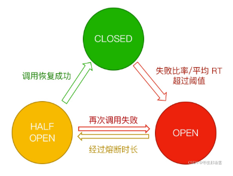
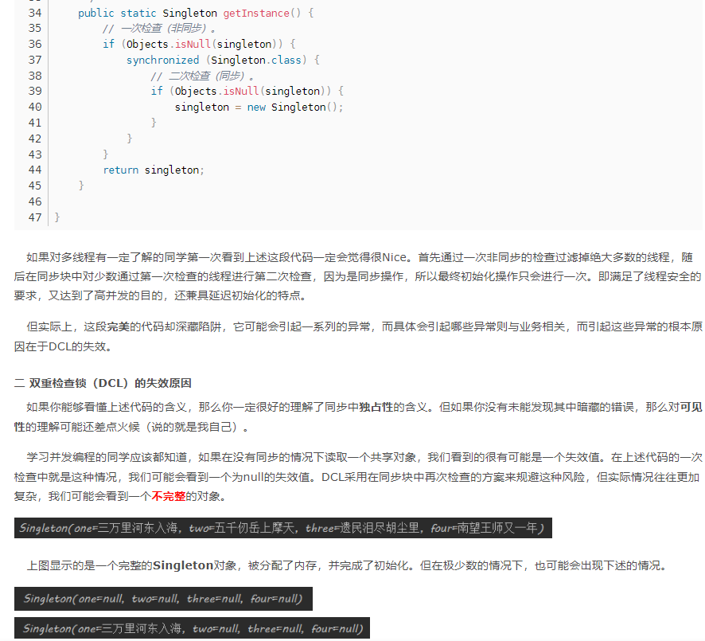

### SlotChain 责任链

责任链模式，设计为多个Slot，各司其职,并通过SPI机制动态从META-INF目录引入，给开发者提供自定义Slot的入口

* 限流：FlowSlot
* 熔断：DegradeSlot
* 黑白名单：AuthoritySlot
* 统计节点：StatisticSlot
* 热点参数：ParamSlot
* 系统状态节点：SystemSlot

### HalfOpen Open Closed 断路器状态机

断路器状态机维护 OPEN,CLOSED,HALF OPEN 三个状态
无需对每次请求判断CanPass
状态机切换使用CAS操作防止并发异常。 AtomicReference 原子类 compareAndSet 方法

### Double Check Lock 双重检测锁与Volatile

[DCL](https://blog.csdn.net/qq_39288456/article/details/112425223)

双重锁检测避免锁粒度过大，volatile防止指令重排序引起dcl失效

